# curiousSearch documentation
## Description
**​curiousSearch** is a specialized OSINT tool designed to bridge the gap between complex Google Dorking and intuitive investigation. Its main goal is to simplify the usage of advanced search operators through a minimalist and efficient Dark Mode interface.

This documentation will help you to familiarize yourself with all the features of curiousSearch.

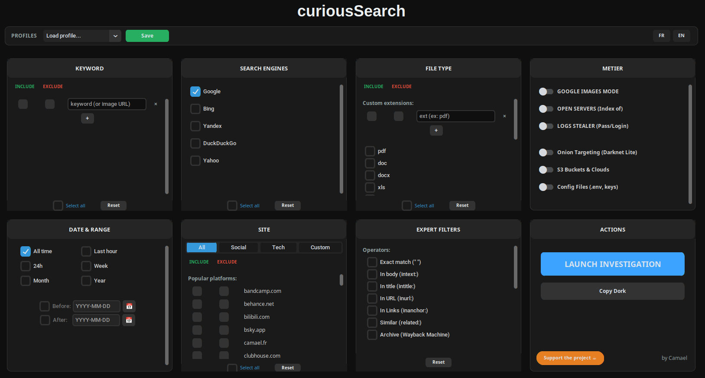

**Documentation's chapters :**
- Basics
- Keyword
- Search engine
- File type
- Metier
- Date & range
- Site
- Expert filters
- Action
- Profiles
___
## BASICS

This tool is generating dorks with your parameters. You can leave blank categories. For example, if any of the options in the file type widget is selected, every files types will be shown.
___

## KEYWORD
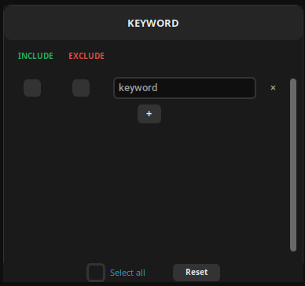

This widget allows you to search certains keywords.

```
🟩 : include keyword

🟥 : exclude keyword

✖️ : remove a certain keyword

➕ : add a keyword
```
You can select every keywords and reset the selection.

___
## SEARCH ENGINE

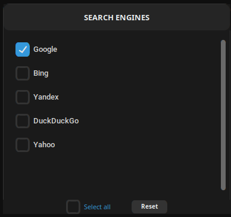

This widget allows you to use different search engine. This is important because indexation between them is very different. It is usual to obtain different results between Google and Bing, for example. Sometimes the generated dork will not work on every search engine, mainly because it's too complex or just because the searche engine returns no results. You can select every search engine and reset the selection.
___
## FILE TYPE

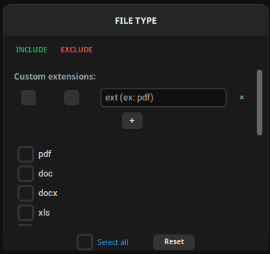

This widget allows you to search for precise file search. You can add custom extesions.
```
🟩 : include file type

🟥 : exclude file type

✖️ : remove a certain file type

➕ : add a file type
```
You can also select extensions thru the extension list. You can select every file types and reset the selection.

___

## METIER
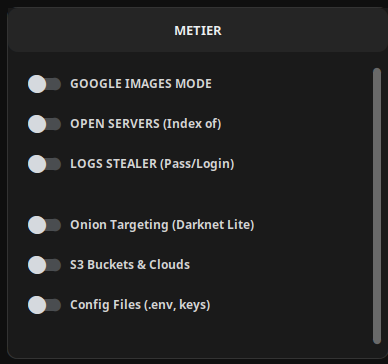

This widget allows you use different built-in functions. Such as :

- **Google image mode**
- **Open Servers**
- **Logs Stealer**
- **Onion Targetting**
- **S3 Bucket & Clouds**
- **Config Files**

**You don't have to select one of the options to be able to run the investigation.** This is optional
Here is a deep view of each functions :

### Google Images Mode :

When this mode is selected, only google will be used for the dork. Every other search engines remain unselected and unselectable until the mode is disabled.

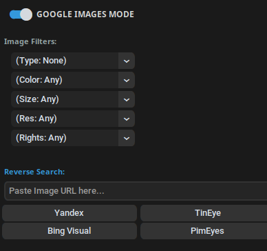

This filters are using the TBS feature :


**Type :**
- Clipart 
- Lineart
- GIF
- Face (yes google images can recognize faces!)


**Color :**
- Full color 
- Black and white
- Transparent (usefull if you need PNGs)
- Red (image with a majority of red in it)
- Green
- Blue

**Size :**
- Icon
- Medium
- Large

**Res :**
- VGA (640×480 pixels)
- 2MP
- 8MP

**Rights :**
- Commercial
- Creative Commons

You can also paste a image URL in the **Reverse Search** field to find similar pictures thru different image search engines.
___

The next options are basicly research presets.

### Open Servers :

curiousSearch can search for open servers available without authentication.

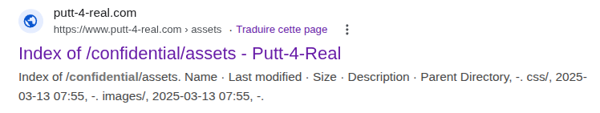

for example, here we found an open index without security.

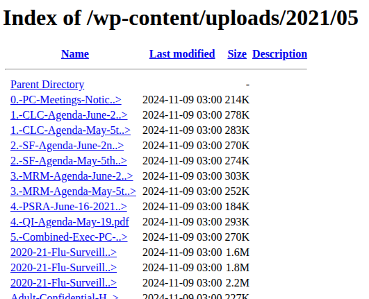

___

### Logs Stealer :

This option is some sort of preset to search for password and logins in  logs, sql and env files.

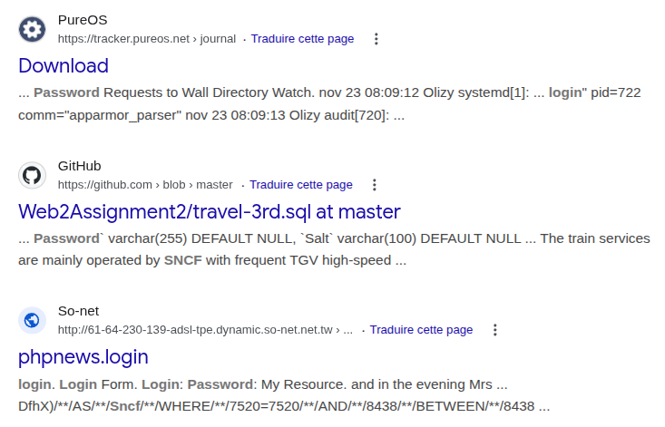

___

### Onion Targeting :

This option is usefull when you want to find onion links related to certain keywords.

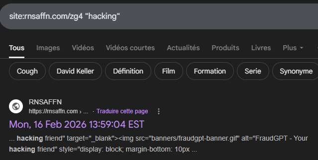
___
### S3 Buckets & Clouds

This option is searching for data in these cloud provider websites : 
- s3.amazonaws.com
- storage.googleapis.com
- blob.core.windows.net

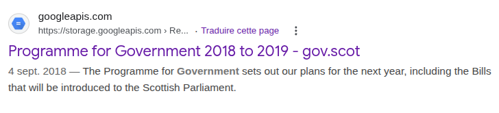


___

### Config Files

This option allows you to search for env, yaml and json files used in databases or in AWS.
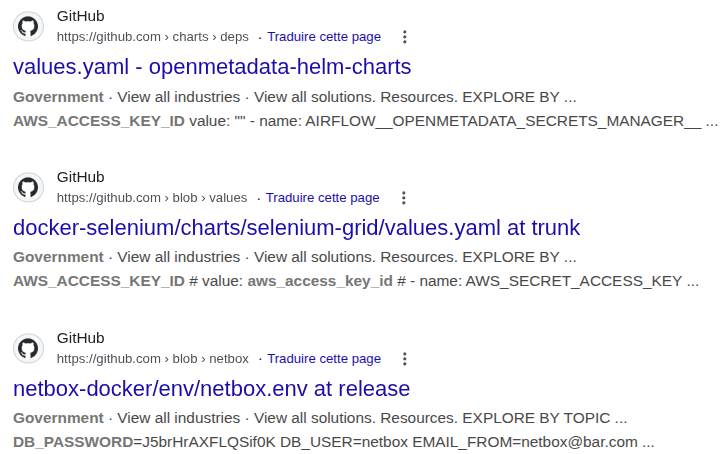

___
___

## DATE & RANGE

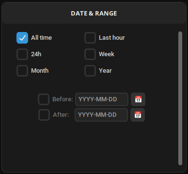

In this widget you are able to choose the period of time where you want your result to be. 

This is very straight forward, just make sure to unselect "All time" to choose any other date filters. If no date filter is choosed, it will be set at "All time" by default.
___
## SITE
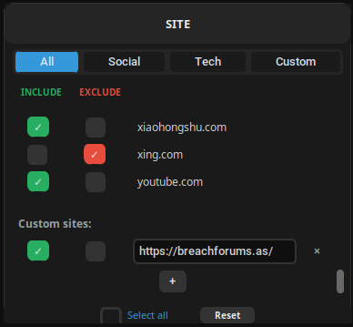

In this widget you can apply filters to websites. 

```
🟩 : include a website

🟥 : exclude a website

✖️ : remove a certain website

➕ : add a website
```

This widget contains 4 categories :

- All
- Social (collection of over 100+ social media websites)
- Tech
- Custom

You can modify each category by adding of deleting websites from the sites.json file. Make sure to respect the format of the file.
You can select every websites and reset the selection.

___

## EXPERT FITLERS :

In this widget, you can enable powerfull filters. Such as dorking operators :

- Exact match (only result with the exact keywords will appear)
- In body (search within the body of web pages)
- In title (search within the title of web pages)
- In URL (search within the URL of web pages)
- In Links (restrict the search to pages containing a specific word in the text of their backlinks)
- Similar
- Archive (search keyword thru the Wayback Machine)

You can also filter filters by continents/countries :

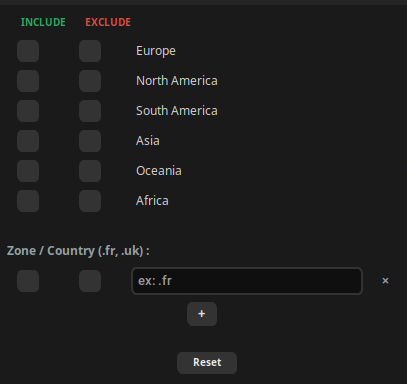

```
🟩 : include a continent

🟥 : exclude a continent

✖️ : remove a certain continent

➕ : add a continent
```
This filter based itself on the countries's TLD.
You can also add countries with the Zone / Country field. Make sure to use a valid TLD. Check [this list](https://ptaff.ca/continents/?lang=en_CA) if you are not sure about the TLD you want to use.
You can select every continents and reset the selection.
___

## ACTIONS 

In this widget you can launch the dork request.
You can also copy the dork.

At any moment, you can press enter to launch the investigation. You can also press ctrl + C to copy the dork.

You can also support me on [buymeacoffee](https://buymeacoffee.com/camael).
